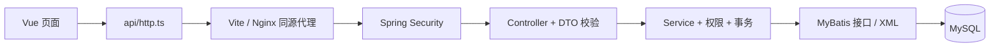
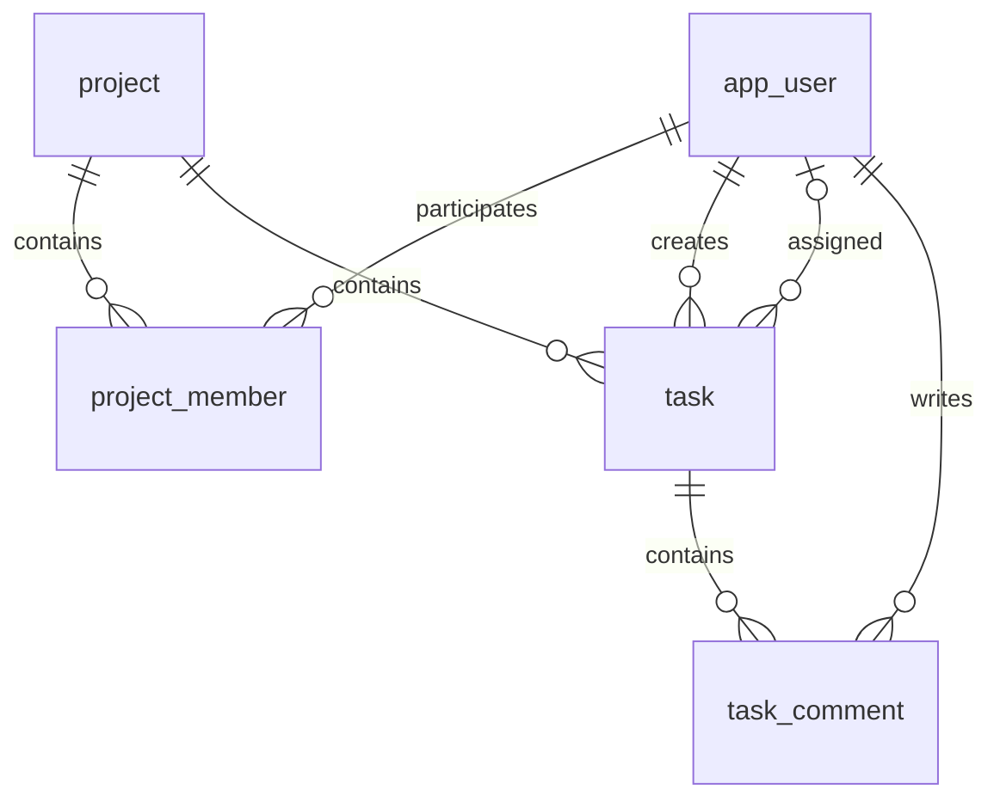

# 架构与关键设计

## 调用链

## 数据关系

project_member 的复合主键为 project_id + user_id，role 属于这个关系。任务 assignee_id 指向用户而不是成员记录，方便保留已完成任务的历史负责人。

## 权限

所有业务接口由 Security 检查登录；服务层每次查询/写入再检查项目成员。非成员统一返回 404，避免泄露项目存在性。
项目编辑、成员搜索/添加/角色/移除仅管理员可操作。普通成员能创建任务与评论，只能修改自己创建或负责的任务。
ProjectAccess.lockMember 在事务中锁定项目行，避免“验证成员后被移除”这类并发竞态。

## 一致性

创建项目与添加创建者成员同事务。移除成员与取消未完成任务指派同事务。
任务更新使用 WHERE id=? AND project_id=? AND version=?，成功后 version+1；零行更新返回 409。
完成任务保留离开项目的负责人。保持已完成状态时可保留历史指派；重新打开任务时清除已离开的负责人。
请求 DTO 控制客户端可写字段，用户 ID/创建者/版本更新等不由前端任意指定。

## 认证

BCryptPasswordEncoder 验证哈希，DaoAuthenticationProvider 执行认证，formLogin 自动保存 SecurityContext。
浏览器使用 HttpOnly Session Cookie；前端不把密码或 Session 标识放进 localStorage。
写请求使用 /api/auth/csrf 获取的 token；CSRF 默认防护保持启用。
API 统一使用 JSON 错误，401/403 Security 响应可无正文，客户端负责展示清晰提示。

## 数据库演进

Flyway V1 兼容原有 project/app_user，V2 增加成员/任务/评论，V3 跟踪一次性演示初始化。
demo profile 对无成员的旧项目建立 Alice/Bob/Charlie 关系，保留所有已有数据。
已执行的迁移不可修改；新增变更建立 V4 等版本。
本地 MySQL 9.6 已完成实际迁移与 HTTP 验证；Flyway 会提示其版本高于官方已验证版本。Compose 使用 MySQL 8.4 LTS。

## 前端职责

页面：ProjectsView、ProjectDetailView、LoginView。
组件：ModalShell、TaskDrawer、MembersPanel、StatsPanel。
接口：http.ts 统一超时、CSRF、错误处理；projects.ts 包装业务地址。
Pinia 只保存公开的当前用户状态，路由守卫每次向后端确认。没有客户端权限判断可以替代后端权限检查。
